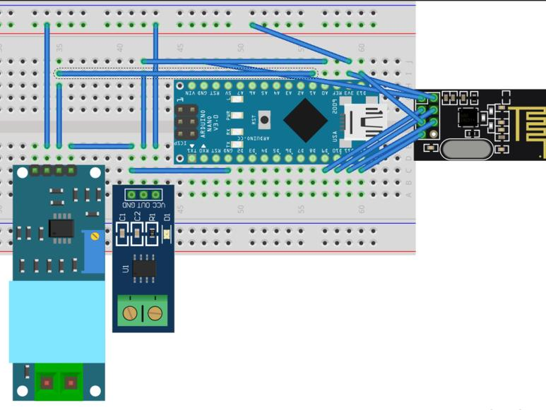
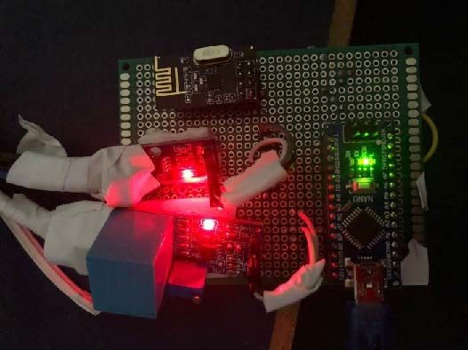

# Generation Node  

### Overview
The Generation Node is a crucial part of the intelligent home solar system project. It is connected to the on-grid inverter and monitors the power generation data. The node uses an ACS-712 current sensor to measure the current output of solar panels and a ZMPT101B voltage sensor to measure the voltage output of solar panels. An Arduino Nano microcontroller board processes the sensor data, and an NRF-24L01 wireless transceiver module sends the collected data to the Master Node.

### Components
- ACS-712 Current Sensor: This sensor measures the current output of solar panels. It is an analog sensor that provides an output proportional to the measured current.

- ZMPT101B Voltage Sensor: This sensor measures the voltage output of solar panels. It is a module that transforms the high voltage into a lower voltage that can be measured by the Arduino board.

- Arduino Nano: This microcontroller board processes the sensor data. It reads the output from the ACS-712 and ZMPT101B sensors, converts it into a readable format, and prepares it for transmission.

- NRF-24L01 Wireless Transceiver Module: This module sends the collected data to the Master Node. It uses the SPI interface to communicate with the Arduino Nano.

### Diagrams

##  Libraries Used
- SPI.h: This library allows Arduino boards to communicate with SPI devices. It is used to interface with the NRF24L01 wireless transceiver module.

- nRF24L01.h: This library provides an interface for the NRF24L01 transceiver module. It defines the commands and registers of the NRF24L01 module.

- RF24.h: This library is used to control the NRF24L01 transceiver module. It provides functions for sending and receiving data, changing the module's settings, and checking the module's status.

- RF24Network.h: This library is used to create a network of NRF24L01 modules. It provides functions for routing and sending network packets.

- Wire.h: This library allows communication between devices using the I2C protocol. It is used to interface with the BH1750 light sensor.

### Wiring
The ACS-712 current sensor and ZMPT101B voltage sensor are connected to the Arduino Nano's analog pins. The NRF-24L01 module is connected to the digital pins and communicates with the Arduino Nano via the SPI interface.

### Future Work
Future improvements to the Generation Node could include adding more sensors to monitor other aspects of the solar panels, such as temperature or irradiance. Additionally, the node could be upgraded to use a more powerful microcontroller or a more advanced wireless communication module.