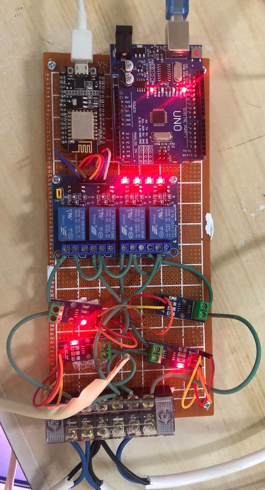

# Load Shedding Node
### Overview
The Load Shedding Node is a critical component of the intelligent home solar system project. It is designed to manage energy consumption efficiently by balancing the energy generated and consumed. The node uses an Arduino UNO, Node MCU ESP8266, 4 Relay Module, 4x ACS 712 sensors, Strip Connector, Wires, and a 9x15 cm Vero Board.

### Components
- Arduino UNO: This microcontroller board is used because analog GPIO pins are required for the current sensors, as NodeMcu Esp8266 only has one Analog GPIO pin.

- Node MCU ESP8266: This is connected to the relay module. The NodeMcu Esp8266 and the Arduino communicate with each other using I2C protocols.

- 4x Relay Module: This module is used to control the loads based on the load shedding algorithm.

- 4x ACS 712 sensors: These sensors are connected to four different loads and measure the devices' current.

- Strip Connector, Wires, and 9x15 cm Vero Board: These are used for the physical connections between the components.

### Diagrams

### Load Shedding Algorithm and Implementation
1. Initialize: Connect to the Firebase database and retrieve the real-time power generation data.

2. Read Current Values: Use the ACS712 Current sensors to measure the current of the four different loads. Send these current values to NodeMcu esp8266 via I2C protocol.

3. Calculate Energy Difference: Calculate the energy difference between the energy generated and the energy consumed.

4. Check Energy Difference:

-- If the energy difference is negative (power generation is less than power consumption):
- Disable the lowest priority load (priority 1).
- Re-evaluate the energy difference.
- If the energy difference is still negative, disable the next lowest priority load (priority 2), and so on, until the energy difference is positive.

-- If the energy difference is positive (power generation is more than power consumption):
- If the energy difference is greater than a set threshold, enable the lowest priority load that is currently off.
- Re-evaluate the energy difference.
- If the energy difference is still positive and greater than the threshold, enable the next lowest priority load that is currently off.
5. Repeat: Continue this process, constantly reading the current values, calculating the energy difference, and adjusting the loads accordingly.

This algorithm allows the system to adapt to changes in both power generation and consumption, ensuring that the most critical loads are always powered and that power is used as efficiently as possible.

### Results
During the testing period, the load-shedding algorithm lowered energy usage by an average of 15% compared to a no-load shedding baseline situation. The most energy was saved during periods of high energy demand when the load-shedding algorithm could quickly shed non-critical loads to avoid energy