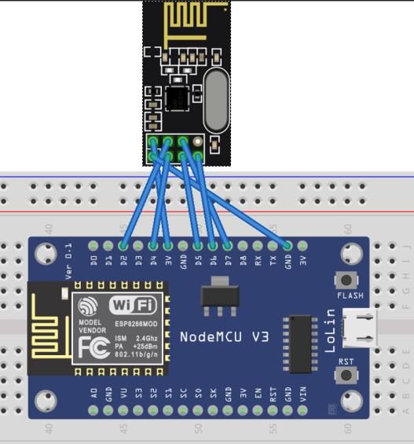

# Master Node

### Overview
The Master Node, also known as the Primary Node, plays a pivotal role in the intelligent home solar system project. It receives data transmitted from both secondary nodes (Weather Node and Generation Node), processes and structures the data, and then uploads it to a Firebase real-time database for easy access and analysis.

### Components
- ESP8266: This is a Wi-Fi microcontroller used for processing and structuring the received data. It's a highly integrated chip designed for the needs of a new connected world. It offers a complete and self-contained Wi-Fi networking solution, allowing it to either host applications or offload all Wi-Fi networking functions from another application processor.

- NRF-24L01: This is a wireless transceiver module used for receiving data from the secondary nodes. It operates in the 2.4GHz band and can operate with baud rates from 250 kbps up to 2 Mbps. If used in open space and with lower baud rate its range can reach up to 100 meters.

### Diagrams

### Libraries Used
- FirebaseESP8266.h: This library allows the ESP8266 to communicate with Firebase, a Google cloud service that provides a real-time database for storing and syncing data across multiple platforms.

- ESP8266WiFi.h: This library provides a networking interface for the ESP8266. It allows the ESP8266 to connect to a Wi-Fi network and perform network operations like sending and receiving data.

- Wire.h: This library allows communication between devices using the I2C protocol. It is used for connecting sensors and other devices to the microcontroller.

- NTPClient.h: This library connects to a Network Time Protocol (NTP) server and allows the ESP8266 to get the current date and time.

- WiFiUdp.h: This library allows UDP communication over Wi-Fi. It is used by the NTPClient library to send and receive UDP packets.

- SPI.h: This library allows SPI communication. It is used for communicating with the NRF24L01 wireless transceiver module.

- nRF24L01.h, RF24.h, RF24Network.h: These libraries are used for controlling the NRF24L01 wireless transceiver module. They provide functions for sending and receiving data, controlling the module's settings, and managing a network of NRF24L01 modules.

### Firebase
Firebase is a Google cloud service that provides a real-time database for storing and syncing data across multiple platforms. In this project, Firebase is used to store the data received from the secondary nodes. The data is uploaded to Firebase using the FirebaseESP8266 library, which provides functions for sending data to Firebase and receiving updates from Firebase in real-time.

The Firebase database and the secret key can be accessed and changed in the config.h

### Wiring
The NRF-24L01 module is connected to the digital pins and communicates with the ESP8266 microcontroller via the SPI interface.

### Future Work
Future improvements to the Master Node could include adding more sensors to monitor other aspects of the solar panels, such as temperature or irradiance. Additionally, the node could be upgraded to use a more powerful microcontroller or a more advanced wireless communication module.