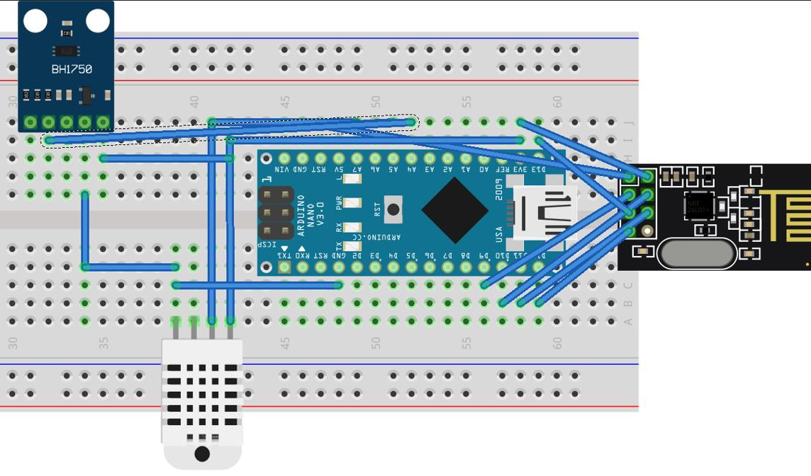
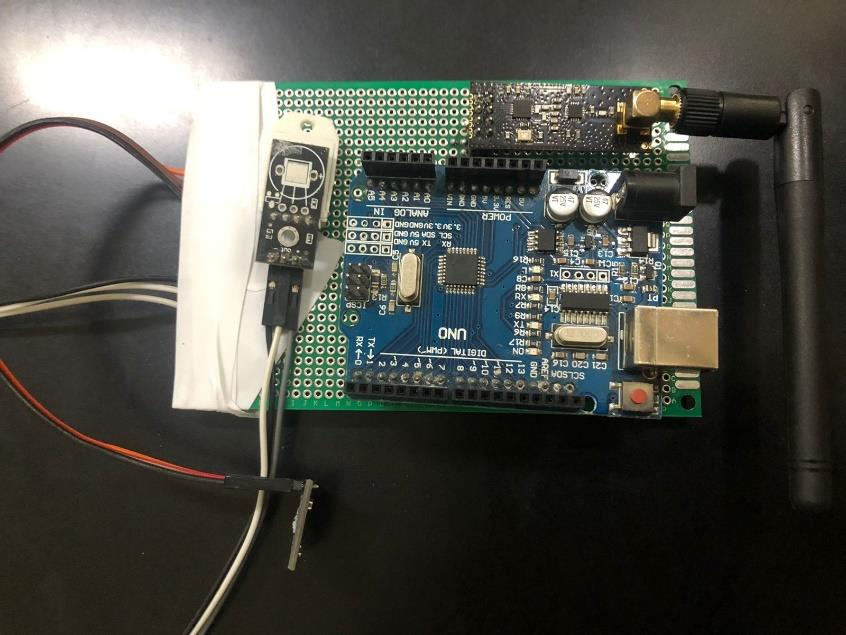

# Weather Node 

### Overview
The Weather Node is a crucial part of the intelligent home solar system project. It is responsible for measuring solar irradiation, temperature, and humidity. The node uses a BH-1750 digital light sensor to measure solar irradiation, a DHT-22 sensor to measure temperature and humidity, an Arduino UNO microcontroller board to process the sensor data, and an NRF-24L01 wireless transceiver module to send the collected data to the Master Node.

### Components
BH-1750 Digital Light Sensor: This sensor measures solar irradiation. It uses the I2C (Inter-Integrated Circuit) protocol for communication with the Arduino UNO.

- DHT-22 Sensor: This sensor measures temperature and humidity. It provides high precision readings and is easy to interface with the Arduino UNO.

- Arduino UNO: This microcontroller board processes the sensor data. It reads the output from the BH-1750 and DHT-22 sensors, converts it into a readable format, and prepares it for transmission.

- NRF-24L01 Wireless Transceiver Module: This module sends the collected data to the Master Node. It uses the SPI interface to communicate with the Arduino UNO.

### Diagrams

### I2C Protocol
The I2C protocol is a serial communication protocol used in embedded systems like microcontrollers and sensors. It is a multi-master, multi-slave protocol that allows several devices to communicate on the same bus. The I2C protocol typically communicates via two wires:

- SDA (Serial Data): This data line is used for bidirectional data transfer between the master and slave devices.

- SCL (Serial Clock): This clock signal synchronizes data flow between master and slave devices.

All devices on an I2C bus are linked to the same two wires and are identifiable by a unique 7-bit address. The master device starts communication by transmitting a start condition to the bus, followed by the address of the slave device with which it wants to communicate. After the slave device recognizes the communication, data can be sent between the devices.

### Libraries Used
The code for the Weather Node uses several libraries to interface with the hardware components and handle data communication. Here is a brief description of each library:

- SPI.h: This library allows Arduino boards to communicate with SPI devices. It is used to interface with the NRF24L01 wireless transceiver module.

- nRF24L01.h: This library provides an interface for the NRF24L01 transceiver module. It defines the commands and registers of the NRF24L01 module.

- RF24.h: This library is used to control the NRF24L01 transceiver module. It provides functions for sending and receiving data, changing the module's settings, and checking the module's status.

- RF24Network.h: This library is used to create a network of NRF24L01 modules. It provides functions for routing and sending network packets.

- DHT.h: This library provides functions for reading data from DHT humidity and temperature sensors. It supports both DHT11 and DHT22 sensors.

- Wire.h: This library allows communication between devices using the I2C protocol. It is used to interface with the BH1750 light sensor.

- BH1750.h: This library provides functions for reading data from the BH1750 light sensor. It supports different modes of operation and resolutions.

### Wiring
The BH-1750 light sensor and DHT-22 temperature and humidity sensor are connected to the Arduino UNO's I2C and digital pins, respectively. The NRF-24L01 module is connected to the digital pins and communicates with the Arduino UNO via the SPI interface.

### Future Work
Future improvements to the Weather Node could include adding more sensors to monitor other aspects of the weather, such as wind speed or atmospheric pressure. Additionally# Weather Node