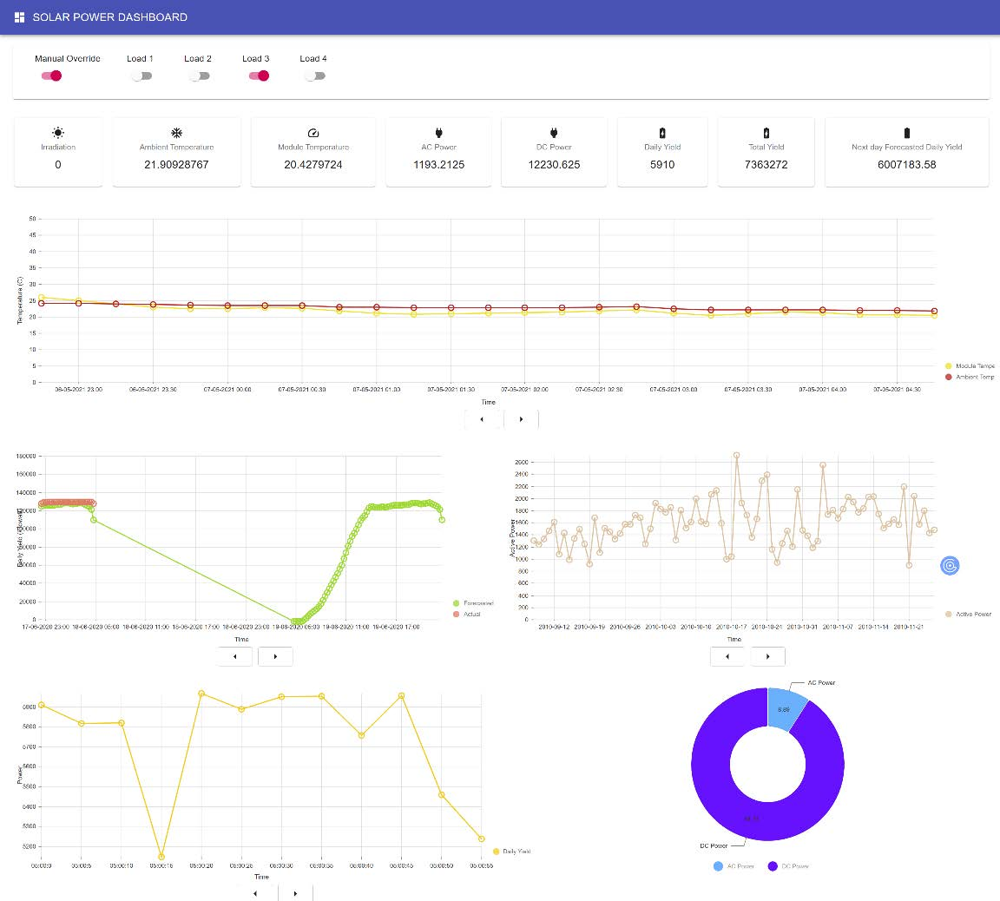

# Solar Power Dashboard

This project is a Solar Power Dashboard built using React and Material UI. It provides real-time monitoring and control of a solar power system. The dashboard displays various metrics such as ambient temperature, module temperature, AC power, DC power, daily yield, and total yield. It also includes a forecast chart, a consumption chart, and a power chart.

## File Structure

The project is structured as follows:

- `App.js`: This is the main entry point of the application. It fetches and manages the data, and renders the different components of the dashboard.

- `components/`: This directory contains all the React components used in the application.

  - `Alerts.js`: This component displays alerts based on the recommendations from the control data.

  - `Buttons.js`: This component renders the navigation buttons used in the charts.

  - `ConsumptionChart.js`: This component renders a chart of power consumption over time.

  - `Controls.js`: This component allows the user to manually override the system and control the loads.

  - `DailyYieldChart.js`: This component renders a chart of the daily yield of the solar power system.

  - `ForecastChart.js`: This component renders a chart of the forecasted and actual power generation.

  - `PowerChart.js`: This component renders a pie chart of the AC and DC power distribution.

  - `SummaryCards.js`: This component displays a summary of the current state of the solar power system.

  - `TemperatureChart.js`: This component renders a chart of the ambient and module temperatures.

- `utils/`: This directory contains utility functions for fetching and updating data.

  - `data.js`: This file contains functions for fetching and updating data from the server.

## Usage

To use this project, you need to have Node.js and Yarn installed on your machine. Then, follow these steps:

1. Clone the repository to your local machine.
2. Navigate to the project directory in your terminal.
3. Run `yarn install` to install the project dependencies.
4. Run `yarn start` to start the development server. The dashboard will be accessible at `http://localhost:3000`.

## Contributing

Contributions are welcome. Please make sure to update tests as appropriate.

## License

This project is licensed under the MIT License.

## Contact

For any questions or concerns, please open an issue on GitHub.
